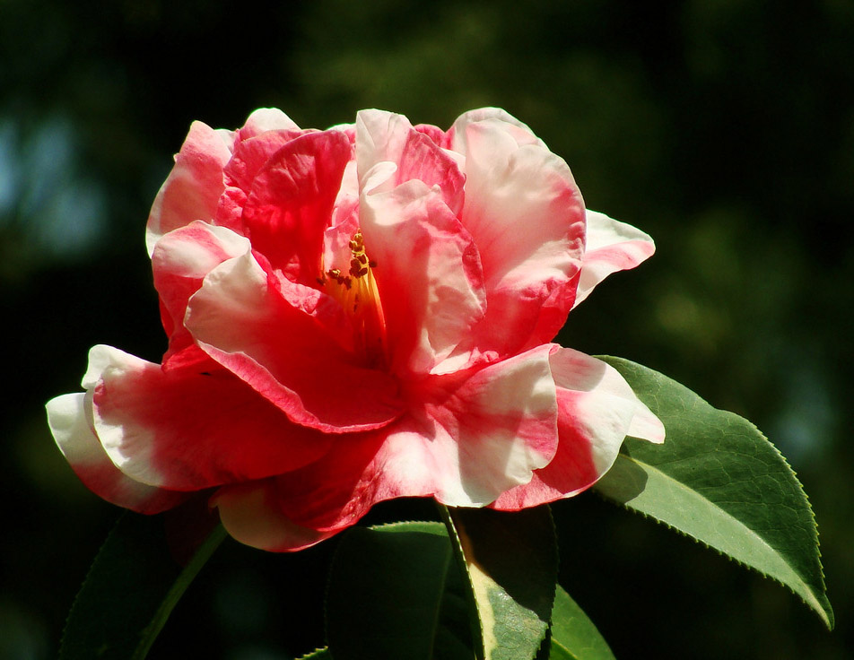

# projectB
<body>
<h1><a href="https://tw.yahoo.com/" target="_blank">4/4新聞</a></h1>
<ul>
    <li><em><strong>政治</strong></em>新聞</li>
         
    <li><em><strong>財經</strong></em>新聞</li>
    <li><em><strong>體育</strong></em>新聞</li>
         
    <li><strong><em>影劇</em></strong>新聞</li>
</ul>
<!--這一行是文字註解,不必顯示-->
<pre>
    測試行       測試  <pre> 的作用</pre>
    
<4月4日，演員韓彩雅在個人SNS親自宣布已經懷孕6週>

    
&nbsp;&nbsp;&nbsp;&nbsp;韓彩雅發文稱：「想親自向大家宣布一個消息，寫親筆信有些不好意思呢。不久前我與相愛的人一起經過慎重對話決定共渡一生，感謝大家的祝福，每天都過得很幸福。一個新生命如同禮物一般來到，我已經是懷孕6週的準媽媽了。再次感謝大家的祝福與應援，我會努力成為一個好人，一個好演員。」

    
&nbsp;&nbsp;&nbsp;&nbsp;不久前，韓彩雅方面宣布將與男友Cha Seji於5月6日舉辦舉辦婚禮。 Cha Seji是亞洲足壇傳奇人物車範根的次子，前韓國國腳車杜里的弟弟。 2017年3月8日，韓彩雅出席電影《非正規職特殊要員》媒體試映會的時候親自公開了戀情。 （責編：邵天翔）<全星網>

    
</body>
